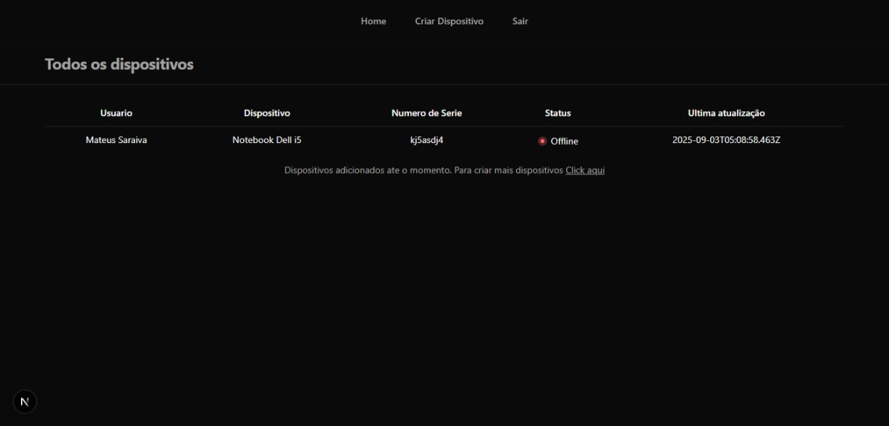

# DevTrack


<p>
  
  
  
  
  
  
</p>

## Introdução

**DevTrack** é uma plataforma de gerenciamento de ativos de TI desenvolvida para empresas que necessitam de controle eficiente sobre seus dispositivos corporativos.  
O sistema permite registrar e categorizar equipamentos, associá-los a colaboradores, monitorar status de utilização, gerenciar números de série e manter um histórico completo de manutenções.

Com o **DevTrack**, a gestão de dispositivos se torna mais organizada, transparente e escalável, reduzindo falhas no inventário e aumentando a produtividade da equipe de TI.

## Tecnologias Utilizadas

- **Front-end & Back-end:** Next.js  
- **Banco de Dados:** PostgreSQL com Prisma ORM  
- **Containerização:** Docker + Docker Compose  
- **Estilização:** Tailwind CSS & shadcn/ui  
- **Segurança:** Bcrypt (criptografia de senhas)  
- **Autenticação:** Auth.js  
- **Deploy:** Vercel  

## Funcionalidades Principais

- Cadastro completo de dispositivos corporativos  
- Associação de dispositivos a colaboradores  
- Controle de disponibilidade dos equipamentos  
- Histórico detalhado de manutenções  
- Registro de números de série  
- Sistema seguro de autenticação e criptografia de dados  

## Screenshots



## Como Rodar o Projeto

### Com Docker

```bash
# Clone o repositório
git clone https://github.com/yolmat/DevicesManager.git
cd DevicesManager

# Suba os containers
docker-compose up --build


# Instale as dependências
npm install

# Rode o projeto
npm run dev
```
O sistema estará disponível em http://localhost:3000

### Deploy

A aplicação está disponível em produção: https://devices.msaraiva.dev.br

## Contribuição

Desenvolvido e mantido por:

<p align="left">
  <a href="https://github.com/yolmat" target="_blank">
    
  </a>
</p>

**Mateus Saraiva** - [GitHub](https://github.com/yolmat)  


## Licença

Este projeto está licenciado sob a MIT License.
Veja o arquivo LICENSE
 para mais detalhes.
